# Introduction
This is a personal project. The main goal of this project was to sharpen my skills with Power BI visualizations, AWS tools, and predictive forecasting. In this project I created visualizations of the dataset using Power BI to gather insights. I then used AWS Sagemaker Studio Lab to create an XGBoost Model that could forecast the Microsoft Stock Price for the next 6 months. Lastly, I compared my forecast with the real stock price for those 6 months to see how well my model performed.

To refine my skills, I included the following in the personal project:
- Power BI Visualizations
- Feature engineering
- Data analysis
- Model creation, evaluation, and visualization
- Predictive Forecasting using XGBoost
- Metrics evaluation and visualizations
- AWS tools

The technologies and libraries used for this project are:
- Power BI
- Python
- Pandas
- NumPy
- Matplotlib
- Seaborn
- Scikit-learn
- Holidays (Python library for getting holiday dates)
- XGBoost
- AWS Sagemaker Studio Lab

# Kaggle Datasets
The first step I took was to find a public dataset to use for training. I found a [Microsoft Stock Kaggle Dataset](https://www.kaggle.com/datasets/vijayvvenkitesh/microsoft-stock-time-series-analysis) which has stock price data for April 2015 - April 2021. As the stock market is closed on weekends, Saturdays and Sundays are not included in the dates. With these days excluded, there are only 1,511 rows in the dataset.

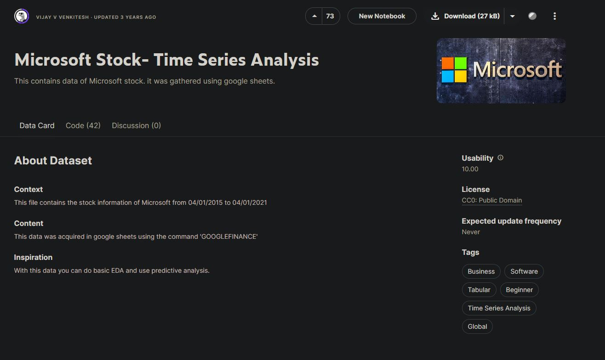
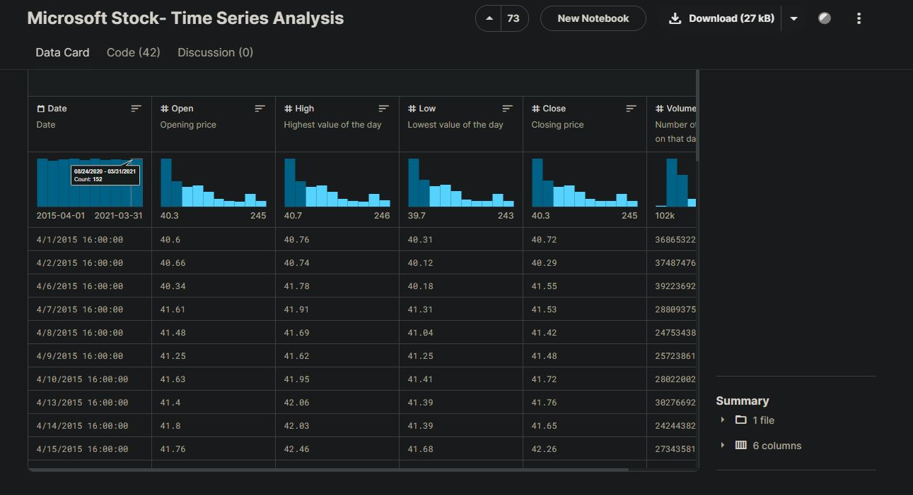

- There are 6 features included in the dataset. These features are:
  - Date: M/D/YYYY H:M:S, all hours are set at 4 P.M. (no data across each day)
  - Open: opening price of the day
  - High: highest value of the day
  - Low: lowest value of the day
  - Close: closing price of the day
  - Volume: number of shares traded that day

The target variable is going to be stock price for each day. As there are 4 columns related to stock price, I chose to create a column called "Average" later in the project to serve as the target variable. This column is created from averaging the "High" and "Low" columns to get the average value of the stock for each day.

I decided to find another dataset that includes data for the 6 months after the first dataset ended (April 2021 - October 2021). I could use this dataset to evaluate how well my model performed in its predictive forecast of 6 months. I found another [Microsoft Stock Kaggle Dataset](https://www.kaggle.com/datasets/berkayalan/microsoft-stock-data-between-2015-and-2022/data). This one had the "High" and "Low" columns that I needed to create the "Average" column like with the first dataset.

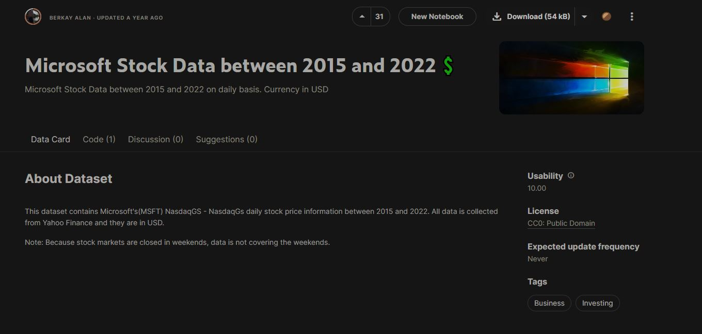
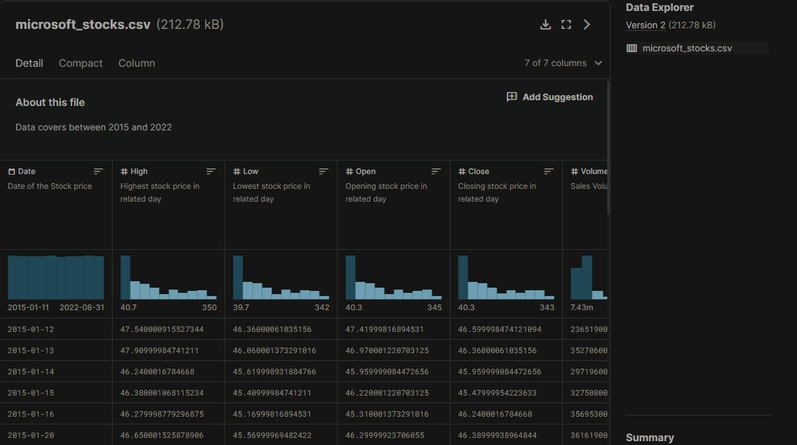

# Power BI Data Analysis & Visualization
I then made visualizations of these features using Power BI. The goal of this was to find anything interesting in the data that seemed interesting or suggested that a feature was critical in the prediction of the stock price.
- I made three features to support in the analysis of data:
  - "Net" which is the amount the stock has changed from the previous day. This can be negative or positive.
  - "Day_of_Week" which signifies what day of the week it is. The numbers were 1 to 5 for Monday to Friday. This feature would later be used for forecasting.
  - "Average" which would serve as the target column. It is the average of the "High" and "Low" columns. This gives us the average stock price for each day.

- When creating and looking at the visualizations, I had to keep in mind a couple of important events that would likely affect the Microsoft stock in some way:
  - Microsoft acquired LinkedIn June 2016
  - Microsoft Teams is announced November 2016
  - COVID-19 emerged in the U.S. roughly January 2020, with Microsoft announcing that all of their stores will be closed due to COVID on June 26
  - Microsoft announced the beta of Windows 10X February 2020
  - Microsoft launches the Xbox Series X and Series S November 2020
 
## Visualizations and Insights:

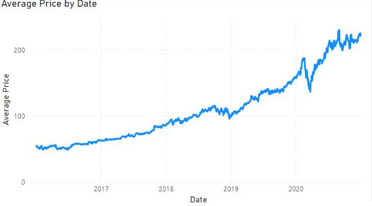
- Average Price by Date: Microsoft had steady growth in stock prices, slight decrease during Q4 of 2018, but then a steeper incline up until March 2020 (possibly due to the onset of COVID in the U.S.). That decrease didn't last long as the steady incline returned for the rest of the chart. The charts begins with a price of 54.10 at the beginning of 2016 and ends at 221.34 at the end of 2020.

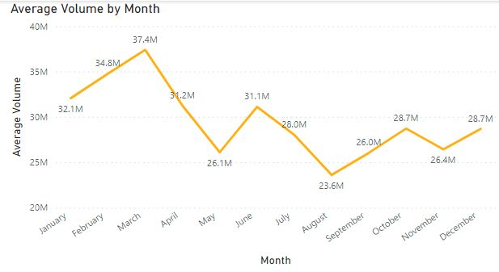
- Mean Volume by Month: it's hard to identify a pattern for the average monthly volume. The only thing that sticks out is that January-April seem a bit higher compared to the later months (31.2M-37.4M). The lowest volume was August with 23.6M while the highest month is March with 37.4M.

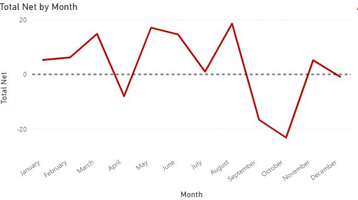
- Total Net by Month: this one gives us an idea of, generally, how much the stock rises during each month. There isn't an identifiable pattern but you can notice a dip between March (14.79) and May (17.0) from positive net to negative net in April (-8.01). There also seems to a large dip from August (18.5) to September (-16.6). October is also quite negative (-23.09) but the chart spikes back up in November (5.16). This leads one to believe that September and October were particularly bad months for the Microsoft stock. 

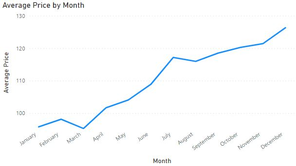
- Average Price by Month: there is a noticeable pattern here. The chart only increases from March ($95.29) to December ($126.32) which is rather interesting. This leads one to believe the price follows a cycle of steadily increasing from March to December and then drop back down in January.

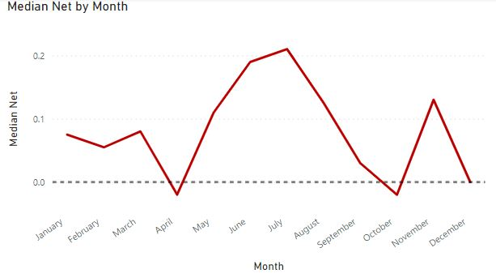
- Median Net by Month: this might help clarify the findings from the previous net chart. The first thing you might notice is that all the months stay above 0 or barely pass under 0, showing that the Microsoft stock typically only increases over time. The dips seen in April and September previously are still seen in the chart, meaning that these aren't likely to be caused by special events but rather happen commonly. There seems to be higher net in the summer months with a only November being a good month of the winter months.

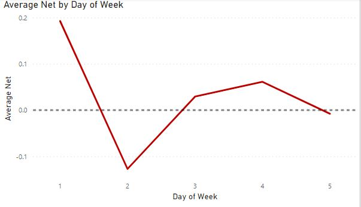
- Average Net by Day: the only thing of interest is that Monday has the highest net of the week at 0.19 with Tuesday being the lowest at -0.13. The rest of the days stay around 0.

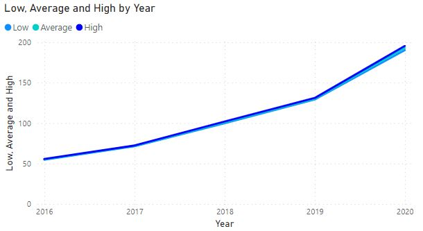
- Low, Average, High by Year: there is a positive trend with the incline getting steeper from 2019 to 2020. There aren't any outliers.

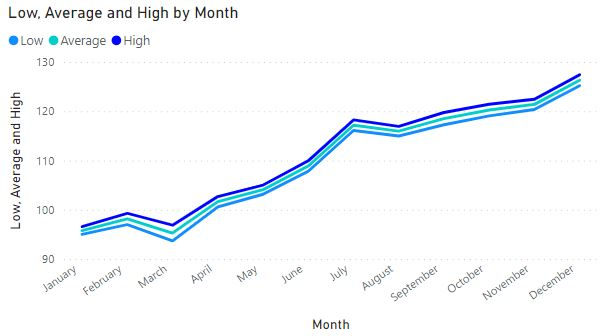
- Low, Average, High by Month: there isn't much of a gap between the three lines, meaning there are no significant outliers. There is a general positive trend from March to December, as seen in other charts.

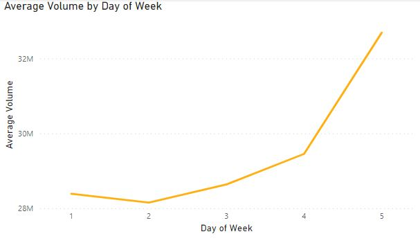
- Average Volume by Day: there appears to be a positive trend, with the volume increasing by a large amount from Thursday (29.5M) to Friday (32.7M). It seems more people tend to trade Microsoft stocks at the end of the week rather than the beginning.

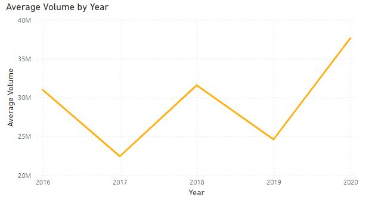
- Average Volume by Year: the volume seems to fluctuate quite a bit yearly, with 2017 and 2019 being the lowest (22M-24M), 2016 and 2018 being a bit higher (31M), and 2020 being the highest at around 37.7M.

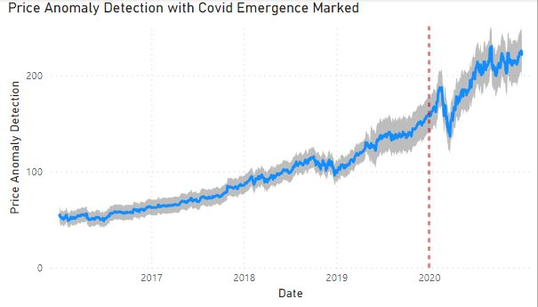
- Price Anomaly Detection with Covid Emergence Marked: this allows us to see if there are any outstanding outliers in the data. I used 85% sensitivity for Power BI's anomaly detection function and wasn't able to detect any anomalies in the dataset. I also marked the point in which COVID emerged in the U.S. (around January 2020). This helps us get a better idea of how COVID might have affected stock prices.

# Data Preparation
Before creating a model to make forecasts, I need to fill in the missing data for weekend days (so that our dataset is continuous) by forward filling (copying the last known data to fill the gaps) as well as removing the time information as the data is always recorded as the same time. I also added the "Average" and "Net" columns like I did for the visualizations. I thought "Net" might be useful in the forecasting prediction if the model was to use features other than datetime ones in its predictions. I made all these changes and saved the CSV using a Jupyter Notebook file. I also did a similar process with the second dataset that was to be used for comparing the model's forecast to the real numbers. I forward filled the weekend days and created an "Average" column using the "High" and "Low" columns. Any numbers with decimals exceeding the hundredth decimal place were rounded to two decimal places. 

While visualizations into the features "Open", "Close", "High", "Low", "Volume", "Net" are interesting, they cannot be used to train the model. The first four have correlations with the target, the "Average" column. Training with correlated features will lead to the model learning to predict a number near to these values. The "Average" column will be used as the target as we want to be forecast the stock price for the next 6 months and this feature serves as a balanced feature of the stock price for each day. The "Net" and "Volume" columns are also interesting to look at but wouldn't help much in training as having the net or volume from 6 months prior likely won't help much in forecasting.

# Forecasting with XGBoost Regressor
Now it's time to discuss the creation of the XGBoost model, training, and evaluation.
Let's go through the steps I took:

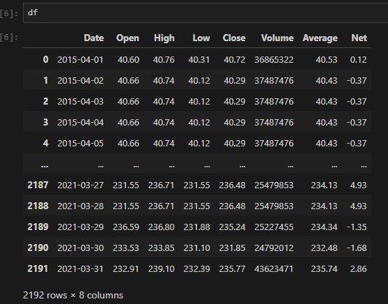
- I took a look at the cleaned dataset to make sure everything was in order.

- I set the Date column as the index and made sure it was the datetime dtype.

- I plotted the "Average" column to get a look at the stock price across the entire dataset

- I made a histogram to check for outliers

- I split the data into 5 folds and made a graph of the training and validation splits of these folds

- I created functions for the creation of time series features and lag features.
  - The time-series features were:
    - Day of the week
    - Quarter
    - Month
    - Year
    - Day of the year
    - Day of the month
    - Week of the year
    - isWeekend (whether day is weekend day or not)
    - US_holiday (whether day is U.S. holiday or not, retrieved from holidays Python library)
  - The lag features were:
    - Lag6 (data from 6 months ago)
    - Lag12 (data from 12 months ago)
    - Lag18 (data from 18 months ago)

- I created a graph to look at the average stock price per quarter

- I also created a graph to look at the average stock price per month

- I then began training, using a XGBoost Regressor with 3000 estimators, early stopping rounds set to 50, max_depth of 3, gbtree for the booster, and a learning rate of 0.01

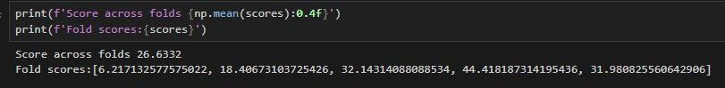
- I then was able to score the folds using RMSE. We notice the folds have mostly similar scores which is good.

- I then trained the model on the entire datset to have a finalized model. We will use 500 estimators, 50 for early stopping rounds, max depth of 3, and a learning rate of 0.1. I chose such this learning rate as the model seemed to train too slowly when it was 0.01. The reason 500 estimators was chosen as that was generally the time in which the folds would stop early. This means that's around the number of estimators when the model begins to overfit. That's why I limited the number of estimators so that overfitting doesn't occur.

- I took a look at the feature importance scores of the features to see what had the largest impact on the target. It seems the year and the three lag features held the most importance, with the other features having little to no impact on the model.

- I then used the fully trained model to forecast the six months after the training data ended.

- I filtered the data from the secondary dataset to be the same timeframe that the model is forecasting on.

- I then compared the two on a graph and calculated the error of the model to be 38.61 Root Mean Squared Error.

- Lastly, I saved the model as a JSON file.

# Conclusion
I was able to create a XGBoost Regressor model that makes forecsats 6 months into the future on the price of the Microsoft stock. I used Power BI, matplotlib, and seaborn for visualizations and used AWS Sagemaker Studio Lab for running Python code and using Python libraries. My model had an RMSE of about 35. The most important features for making predictions were the current year and data from 6 months, 12 months, and 18 months ago (lag features). While I'm satisfied with my model's performance, I believe there is room for improvement. As I only had date-related features to work with, I believe that additional numerical features could improve the model's performance. I would consider incorporating multiple other datasets to help improve the predictions, such as COVID-19 cases, other stock prices of similar companies, or maybe a dataset with some sort of numerical value determining growth or interest level of technological products.
